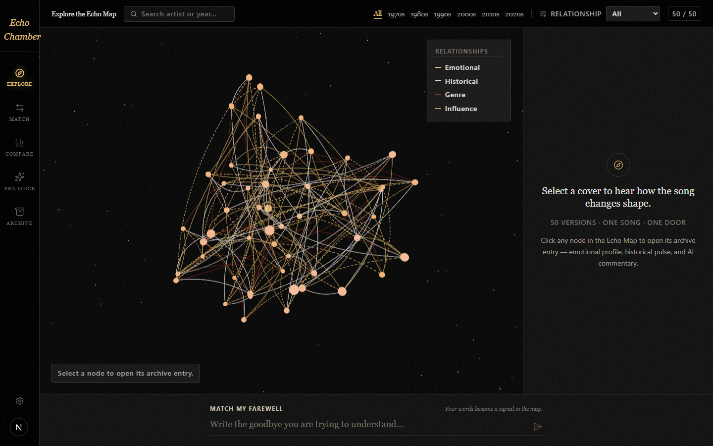
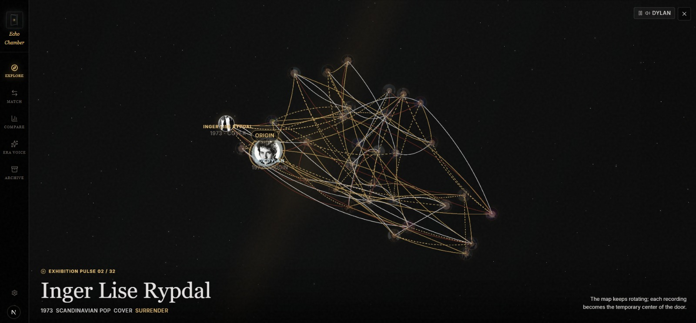
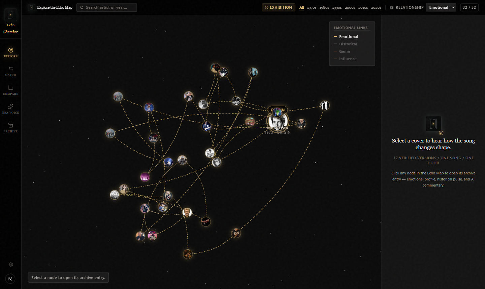
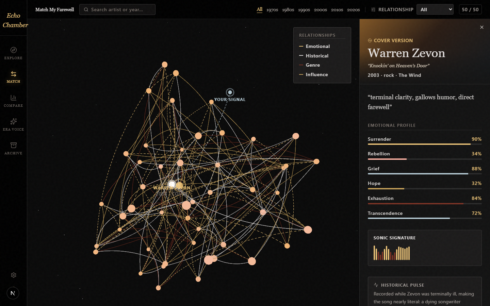
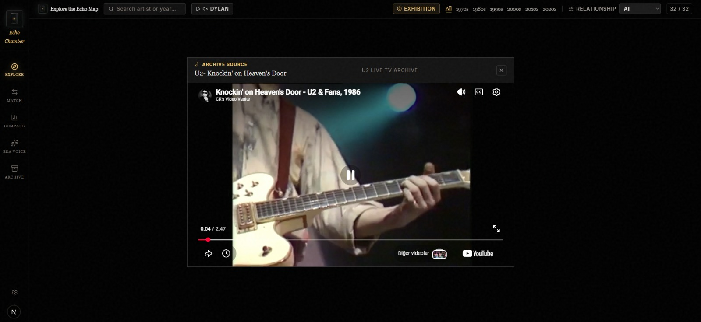
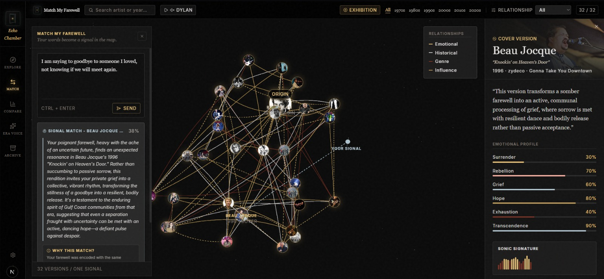
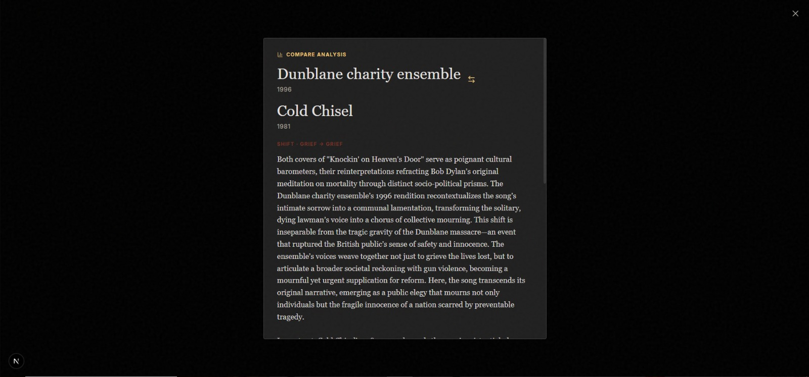
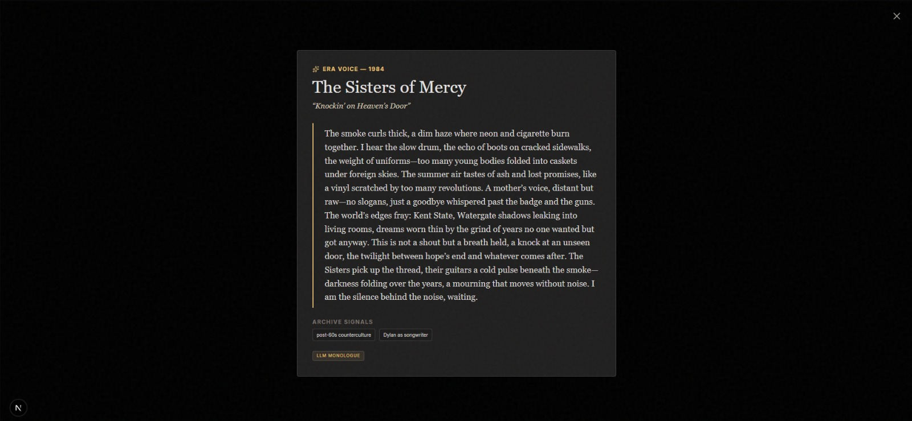
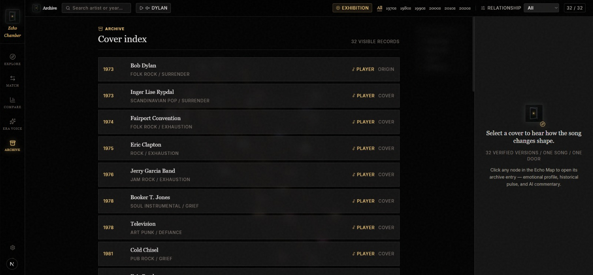
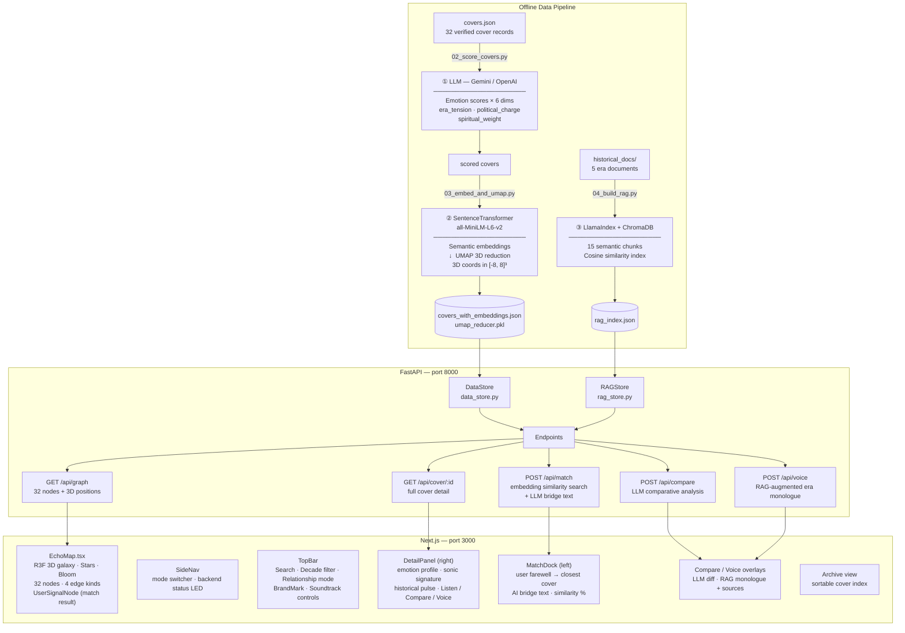

# Echo Chamber AI

Interactive AI artwork for the CSE 358 "KNOCK - Design Your Door" assignment.

Echo Chamber maps covers of Bob Dylan's "Knockin' on Heaven's Door" as a 3D emotional galaxy. The backend processes cover metadata, generates musicological interpretations with Gemini or OpenAI, prepares embedding/UMAP coordinates, and exposes the API used by the frontend experience.

## Live Deployment

| Service | URL |
|---------|-----|
| **Live artwork** | <https://echo-chamber-ai-phi.vercel.app> |
| **Backend API** | <https://echo-chamber-ai-api.onrender.com> |
| **Backend health** | <https://echo-chamber-ai-api.onrender.com/health> |

The frontend is deployed on Vercel from `frontend/`. The backend is deployed on
Render from `render.yaml` using the free web-service tier.

Render free services sleep after 15 minutes without inbound traffic, so this
repository includes `.github/workflows/keep-render-awake.yml`, which pings the
backend health endpoint every 10 minutes during the submission period. It can be
removed after grading if the live deployment no longer needs to stay warm.

## Deliverables

| Item | Location |
|------|----------|
| **Artwork** | Live Vercel link above, or run backend + frontend locally |
| **Artist's Manifesto** | [`MANIFESTO.md`](MANIFESTO.md) |
| **Code Repository** | This repo; see Architecture, Setup, AI Techniques, and Screenshots below |

Note: the artwork can be reviewed from the live Vercel deployment above, or run
locally with the setup instructions below.

## Screenshots

**Galaxy overview** — 32 verified covers mapped as nodes in 3D emotional space, connected by four kinds of relationships (emotional proximity, historical era, genre affinity, influence chains).



**Exhibition mode** — Auto-rotating slideshow cycles through all 32 covers every 2.6 seconds. A bottom HUD shows the current cover's artist, year, genre, and dominant emotion; a counter tracks position in the sequence (02 / 32 shown). The Dylan soundtrack plays softly in the background.



**Emotional edges** — Relationship mode set to Emotional only; affinity clusters become visible as the other edge kinds are hidden.



**Cover detail panel** — Selecting a node reveals the cover's emotional profile across six dimensions, AI-generated meaning-shift quote, sonic signature bar chart, and historical pulse. Action buttons (Listen, Compare, Era Voice) are at the bottom.



**Listen — archive source player** — Clicking Listen opens an in-app YouTube embed for the selected cover. The modal is titled with the archive source label so the viewer always knows which recording is playing.



**Match mode** — The left-side MatchDock accepts a personal farewell text. The embedding model finds the nearest cover in the galaxy and the LLM generates a bridge text explaining the match.



**Compare mode** — Select two covers to trigger an LLM comparative analysis. The overlay reports the emotional shift direction, era pair, and a narrative paragraph.



**Era Voice** — The RAG pipeline retrieves historical document chunks relevant to the cover's era, then the LLM writes a first-person monologue as if the era itself is speaking. Archive signals (retrieved source tags) are shown below the monologue.



**Archive view** — Sortable index of all 32 covers, filterable by the active search and decade selection.



## Submission Checklist

The assignment asks for three mandatory deliverables:

- **Functioning digital artwork:** Echo Chamber AI is available at the live
  Vercel URL and can also be run locally from this repository.
- **Artist's Manifesto:** `MANIFESTO.md` is the reflective 1,500–3,000 word
  manifesto covering medium choice, Dylan/song resonance, AI's role, and the
  personal meaning of "knocking on heaven's door."
- **Code repository with README:** this GitHub repository contains the source
  code, architecture overview, setup instructions, API/dependency notes, AI
  technique explanation, screenshots, and deployment notes.

The README also makes the AI usage transparent: Gemini/OpenAI are used for LLM
generation, SentenceTransformer + UMAP for semantic spatial mapping, and a local
RAG index for historically grounded era voice generation.

## Project Structure

- `backend/` — FastAPI API server, data pipeline scripts, AI services
- `frontend/` — Next.js + React Three Fiber interactive galaxy
- `backend/data/covers.json` — 32 verified-cover dataset with emotion scores
- `backend/data/historical_docs/` — RAG source documents (1973 era)
- `docs/` — API contract, backend runbook, data sources
- `MANIFESTO.md` — Artist's statement (1,750 words)

Deploy note: `backend/data/processed/` contains the committed graph, RAG, and
UMAP artifacts needed by Render. Local cache files such as `score_cache.json`
remain ignored.

## Architecture

### System Diagram



> All LLM-backed endpoints fall back to locally generated text when no API key is configured.

### How the three AI techniques interact

The three techniques are designed to reinforce each other rather than operate independently:

1. **LLM scoring** assigns each cover its emotional coordinates (6 dimensions + 3 era weights).
2. **SentenceTransformer + UMAP** encodes cover metadata into semantic vectors and collapses them into the 3D galaxy; covers the LLM scored as emotionally close end up spatially close.
3. **RAG** grounds the `/api/voice` era monologue in real historical documents from the same decade as the cover — so a 1973 cover speaks with 1973 texture, and a 1990 cover with 1990 texture.

When a user types a farewell in Match mode, the same embedding model that built the galaxy encodes their text and finds the nearest cover by cosine similarity — connecting the user's emotional moment directly to the galaxy's geometry.

## UI Feature Tour

### Echo Map (3D Galaxy)

The central canvas uses React Three Fiber with `Stars`, post-processing `Bloom`, and `OrbitControls`. Each of the 32 verified covers is a glowing node positioned by UMAP-projected semantic coordinates. Four relationship edge kinds can be toggled:

- **Emotional proximity** — covers with similar LLM emotion profiles
- **Historical era** — covers from the same decade
- **Genre affinity** — covers sharing a genre cluster
- **Influence chains** — known influence relationships

Nodes dim or highlight in response to search terms, decade filters, and active modes. In **Exhibition mode** the galaxy auto-rotates through each cover on a 2.6-second cycle with a HUD overlay.

### Navigation Layout

- **TopBar** (fixed top) — BrandMark icon, search box, decade filter buttons, relationship-mode selector, filter count badge, soundtrack play/pause toggle.
- **SideNav** (fixed left, 80 px) — five mode buttons (Explore · Match · Compare · Era Voice · Archive), a settings button, and a live backend connection LED that glows green when the API is reachable.

### Dylan Soundtrack

`BackgroundSoundtrack.tsx` loads `bob-dylan-knockin-on-heavens-door.mp3` from the public folder and plays it softly (28 % volume) as an ambient exhibition layer. Autoplay is unlocked on the first user interaction. The play/pause toggle lives in the TopBar.

### Match Mode

Clicking **Match** opens `MatchDock` as a left-side panel. The user writes a personal farewell (minimum 12 characters, at least 3 meaningful words). The text is sent to `/api/match`, which:

1. Encodes the text with the same SentenceTransformer model used to build the galaxy.
2. Finds the nearest cover by cosine similarity.
3. Optionally asks the LLM to write a **bridge text** — a short explanation connecting the user's words to the matched cover's emotional signature.

The panel shows the matched cover, similarity percentage, bridge text (tagged `llm` or `local_fallback`), and the match method (`embedding` or `keyword_fallback`). A **UserSignalNode** appears in the galaxy at the position corresponding to the user's embedding, visually placing the user inside the emotional space.

### Cover Detail Panel

Clicking any node opens `DetailPanel` on the right. It shows:

- Hero header with artist name, year, genre, album, and origin badge
- AI-generated meaning-shift quote
- Animated emotional profile bars (surrender · defiance · grief · hope · exhaustion · transcendence)
- Sonic signature — a bar chart interpolated at 3× resolution from the emotion scores
- Historical pulse grounding the cover in its era
- Action buttons: **Listen** (YouTube embed), **Compare**, **Era Voice**

### Compare Mode

Select two covers and click **Compare**. The backend calls the LLM with both covers' metadata and returns a structured analysis: shift direction (e.g., `defiance → transcendence`), era pair, historical contexts, and a narrative paragraph.

### Era Voice Mode (RAG)

Select a cover and click **Era Voice**. The backend retrieves the most relevant historical document chunks from the RAG index (built from five era documents), then prompts the LLM to write a 150-word first-person monologue as if the era itself is speaking. The response includes which source chunks were used, displayed in the UI as attribution.

### Archive View

A sortable table of all 32 covers, filterable by current search/decade state. Columns include year, artist, genre, and dominant emotion.

### Health / System Trace

A settings overlay (gear icon in SideNav) shows a live system trace:

- Backend connection status
- LLM provider (Gemini or fallback)
- Embedding / UMAP availability
- RAG index status
- Processed archive size
- Last match similarity score

`/health` reports all of these fields in JSON for external monitoring.

## Backend Setup

```bash
cd backend
python -m venv .venv
.venv\Scripts\activate
pip install -r requirements.txt
copy .env.example .env
```

Set Gemini as the default generation/scoring provider in `backend/.env`:

```env
LLM_PROVIDER=gemini
GEMINI_API_KEY=your_key_here
GEMINI_MODEL=gemini-2.5-flash
```

Optionally, add OpenAI as a secondary provider. Compare and Era Voice prefer OpenAI when an OpenAI key is present, but automatically use Gemini when only Gemini is configured:

```env
OPENAI_API_KEY=your_openai_key_here
OPENAI_MODEL=gpt-4.1-mini
```

Alternatively, set OpenAI as the default provider:

```env
LLM_PROVIDER=openai
OPENAI_API_KEY=your_key_here
```

Run the API:

```bash
uvicorn main:app --reload --port 8000
```

Useful first checks:

```bash
curl http://localhost:8000/health
curl http://localhost:8000/api/graph
curl http://localhost:8000/api/cover/dylan_1973
```

## Frontend Setup

The frontend requires the backend API to be running first (see **Backend Setup** above).

```bash
cd frontend
npm install
npm run dev
```

The app runs at `http://localhost:3000`.

### Environment variable

By default the frontend calls `http://localhost:8000`. To point at a different backend, create `frontend/.env.local`:

```env
NEXT_PUBLIC_API_URL=http://localhost:8000
```

### Dylan soundtrack audio file

The background soundtrack expects `frontend/public/audio/bob-dylan-knockin-on-heavens-door.mp3`. This file is not committed to the repository (copyright). Place the MP3 there before running locally if you want the ambient audio; the app degrades gracefully if the file is absent.

### Key dependencies

| Package | Purpose |
|---------|---------|
| `next` 16 | App framework (has breaking changes — see `frontend/AGENTS.md`) |
| `react` / `react-dom` 19 | UI layer |
| `three` + `@react-three/fiber` | 3D galaxy renderer |
| `@react-three/drei` | R3F helpers (OrbitControls, Stars, labels) |
| `@react-three/postprocessing` | Bloom post-processing effect |
| `tailwindcss` v4 | Styling |
| `lucide-react` | Icon set (replaces removed Material Symbols font) |

### Frontend scripts

```bash
npm run dev      # dev server on :3000 with hot reload
npm run build    # production build (zero errors expected)
npm run start    # serve the production build
npm run lint     # ESLint
```

## Production Deployment

### Backend — Render

`render.yaml` defines a Render Web Service (Python 3.12, free tier):

- **Build:** `pip install -r requirements-deploy.txt`
- **Start:** `uvicorn main:app --host 0.0.0.0 --port $PORT`
- **Health check:** `/health`

Secret environment variables (set in the Render dashboard — never committed):

| Variable | Required | Notes |
|----------|----------|-------|
| `GEMINI_API_KEY` | Yes (primary LLM) | Free-tier key works; rate limits trigger graceful fallback |
| `OPENAI_API_KEY` | Optional | Used for Compare/Voice if present; Gemini is used otherwise |

Static environment variables set in `render.yaml`:

```
APP_ENV=production
LLM_PROVIDER=gemini
GEMINI_MODEL=gemini-2.5-flash
OPENAI_MODEL=gpt-4.1-mini
```

**Committed processed artifacts** — the following files in `backend/data/processed/` are committed so Render can serve the full semantic experience without re-running the pipeline:

| File | Contents |
|------|----------|
| `covers_with_embeddings.json` | All 32 covers with SentenceTransformer embeddings and UMAP positions |
| `rag_index.json` | RAG chunk index (15 chunks from 5 era documents) |
| `umap_bounds.json` | Canvas normalization boundaries |
| `umap_reducer.pkl` | Trained UMAP model for projecting new embeddings at query time |

`score_cache.json` is intentionally not committed.

### Frontend — Vercel

Import the repository to Vercel, set the root directory to `frontend/`, and add one environment variable:

```
NEXT_PUBLIC_API_URL=https://echo-chamber-ai-api.onrender.com
```

### Keep-awake workflow

`.github/workflows/keep-render-awake.yml` runs a GitHub Actions cron job every 10 minutes during the submission period. It pings `/health` to prevent the Render free-tier service from sleeping between reviewer visits. Remove this workflow after grading if the deployment no longer needs to stay warm.

## Backend Pipeline

Run these from `backend/`.

0. Validate the cover metadata:

```bash
python scripts/00_validate_covers.py
python scripts/01_build_covers.py
```

1. Score the cover metadata with the configured provider:

```bash
python scripts/02_score_covers.py
```

Useful scoring options:

```bash
# Validate input and see which covers would be scored without calling an API.
python scripts/02_score_covers.py --dry-run --limit 5

# Score only selected covers.
python scripts/02_score_covers.py --ids dylan_1973,clapton_1975

# Retry transient provider/rate-limit failures and keep going after one cover fails.
python scripts/02_score_covers.py --retries 3 --continue-on-error

# Rescore covers that already have llm_analysis.
python scripts/02_score_covers.py --force
```

The scorer writes after each successful cover and keeps a local cache under `backend/data/processed/score_cache.json`, so interrupted runs can resume without repeating successful paid calls.

2. Build semantic embeddings and 3D UMAP positions:

```bash
python scripts/03_embed_and_umap.py
```

3. After historical documents are added under `backend/data/historical_docs/`, build the local RAG index:

```bash
python scripts/00_validate_rag_docs.py
python scripts/04_build_rag.py --dry-run
python scripts/04_build_rag.py
```

Then restart the API.

## Tests

Run backend tests from `backend/`:

```bash
python -m pytest -q
```

Fast script checks without API/model calls:

```bash
python scripts/00_validate_covers.py
python scripts/01_build_covers.py
python scripts/02_score_covers.py --dry-run --limit 5
python scripts/03_embed_and_umap.py --dry-run
python scripts/04_build_rag.py --dry-run
```

GitHub Actions runs the lightweight backend CI workflow on pushes and pull requests using:

```text
.github/workflows/backend-ci.yml
backend/requirements-ci.txt
```

## API Overview

Base URL:

```text
http://localhost:8000
```

Production API:

```text
https://echo-chamber-ai-api.onrender.com
```

Endpoints:

| Method | Path | Description |
|--------|------|-------------|
| `GET` | `/health` | System status: LLM provider, embedding/UMAP/RAG availability, cover count |
| `GET` | `/api/graph` | All 32 covers with 3D positions and emotion scores |
| `GET` | `/api/cover/{id}` | Full cover detail (emotion profile, meaning shift, historical pulse) |
| `POST` | `/api/compare` | LLM comparative analysis between two cover IDs |
| `POST` | `/api/voice` | RAG-augmented era monologue for a cover |
| `POST` | `/api/match` | Semantic match of user text → nearest cover + LLM bridge text |

LLM-backed endpoints use the configured provider and degrade safely to local fallback text if no key is available or a quota error occurs.

The frontend-facing contract is documented in:

```text
docs/API_CONTRACT.md
```

FastAPI also exposes typed OpenAPI docs while the server is running:

```text
http://localhost:8000/docs
http://localhost:8000/openapi.json
```

## AI Techniques

Three distinct generative AI techniques are deeply integrated:

| Technique | Role in the artwork |
|-----------|-------------------|
| **LLM Emotion Scoring** (Gemini / OpenAI) | Scores each cover on 6 emotional dimensions: surrender, defiance, grief, hope, exhaustion, transcendence. Produces `era_tension`, `political_charge`, `spiritual_weight`. Also generates bridge text connecting a user's farewell to a matched cover. |
| **Sentence Embeddings + UMAP** (`all-MiniLM-L6-v2`) | Converts cover metadata to semantic vectors; UMAP reduces to 3D galaxy coordinates. Powers the `/api/match` semantic search and places the UserSignalNode in the galaxy at the user's embedding position. |
| **RAG Pipeline** (LlamaIndex + ChromaDB) | Retrieves from 5 historical documents (Vietnam, 1973, Pat Garrett, Dylan) to ground the era voice monologue in real historical texture. Retrieved source chunks are surfaced in the UI. |

All three techniques interact: LLM scores shape the embedding neighborhood structure, and the RAG voice is grounded in the same historical period that the embedding positions reflect.

All LLM-backed endpoints fall back to locally generated text when no API key is configured, so the artwork is fully explorable without credentials.

## RAG Source Work

The source prep guide is here:

```text
docs/RAG_PREP_GUIDE.md
```

Minimum documents:

- `1973_world_events.txt`
- `vietnam_and_returning_soldiers.txt`
- `pat_garrett_film_context.txt`
- `counterculture_and_dylan_1970s.txt`
- `dylan_nobel_and_songwriting.txt`

## Repository Name

Working repository name: **echo-chamber-ai**.
