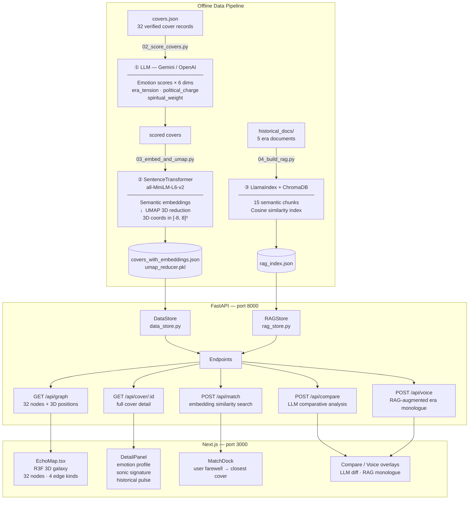

# Echo Chamber AI

Interactive AI artwork for the CSE 358 "KNOCK - Design Your Door" assignment.

Echo Chamber maps covers of Bob Dylan's "Knockin' on Heaven's Door" as a 3D emotional galaxy. The backend processes cover metadata, generates musicological interpretations with Gemini or OpenAI, prepares embedding/UMAP coordinates, and exposes the API used by the frontend experience.

## Live Deployment

| Service | URL |
|---------|-----|
| **Live artwork** | <https://echo-chamber-ai-phi.vercel.app> |
| **Backend API** | <https://echo-chamber-ai-api.onrender.com> |
| **Backend health** | <https://echo-chamber-ai-api.onrender.com/health> |

The frontend is deployed on Vercel from `frontend/`. The backend is deployed on
Render from `render.yaml` using the free web-service tier.

Render free services sleep after 15 minutes without inbound traffic, so this
repository includes `.github/workflows/keep-render-awake.yml`, which pings the
backend health endpoint every 10 minutes during the submission period. It can be
removed after grading if the live deployment no longer needs to stay warm.

## Deliverables

| Item | Location |
|------|----------|
| **Artwork** | Live Vercel link above, or run backend + frontend locally |
| **Artist's Manifesto** | [`MANIFESTO.md`](MANIFESTO.md) |
| **Code Repository** | This repo; see Architecture, Setup, AI Techniques, and Screenshots below |

Note: the artwork can be reviewed from the live Vercel deployment above, or run
locally with the setup instructions below.

## Submission Checklist

The assignment asks for three mandatory deliverables:

- **Functioning digital artwork:** Echo Chamber AI is available at the live
  Vercel URL and can also be run locally from this repository.
- **Artist's Manifesto:** `MANIFESTO.md` is the reflective 1,500-3,000 word
  manifesto covering medium choice, Dylan/song resonance, AI's role, and the
  personal meaning of "knocking on heaven's door."
- **Code repository with README:** this GitHub repository contains the source
  code, architecture overview, setup instructions, API/dependency notes, AI
  technique explanation, screenshots, and deployment notes.

The README also makes the AI usage transparent: Gemini/OpenAI are used for LLM
generation, SentenceTransformer + UMAP for semantic spatial mapping, and a local
RAG index for historically grounded era voice generation.

## Project Structure

- `backend/` — FastAPI API server, data pipeline scripts, AI services
- `frontend/` — Next.js + React Three Fiber interactive galaxy
- `backend/data/covers.json` — 32 verified-cover dataset with emotion scores
- `backend/data/historical_docs/` — RAG source documents (1973 era)
- `docs/` — API contract, backend runbook, data sources
- `MANIFESTO.md` — Artist's statement (1,750 words)

Deploy note: `backend/data/processed/` contains the committed graph, RAG, and
UMAP artifacts needed by Render. Local cache files such as `score_cache.json`
remain ignored.

## Architecture

### System Diagram



> All LLM-backed endpoints fall back to locally generated text when no API key is configured.

### How the three AI techniques interact

The three techniques are designed to reinforce each other rather than operate independently:

1. **LLM scoring** assigns each cover its emotional coordinates (6 dimensions + 3 era weights).
2. **SentenceTransformer + UMAP** encodes cover metadata into semantic vectors and collapses them into the 3D galaxy; covers the LLM scored as emotionally close end up spatially close.
3. **RAG** grounds the `/api/voice` era monologue in real historical documents from the same decade as the cover — so a 1973 cover speaks with 1973 texture, and a 1990 cover with 1990 texture.

When a user types a farewell in Match mode, the same embedding model that built the galaxy encodes their text and finds the nearest cover by cosine similarity — connecting the user's emotional moment directly to the galaxy's geometry.

## Backend Setup

```bash
cd backend
python -m venv .venv
.venv\Scripts\activate
pip install -r requirements.txt
copy .env.example .env
```

Set Gemini as the default generation/scoring provider in `backend/.env`:

```env
LLM_PROVIDER=gemini
GEMINI_API_KEY=your_key_here
GEMINI_MODEL=gemini-2.5-flash
```

Optionally, add OpenAI as a secondary provider. Compare and Era Voice prefer OpenAI when an OpenAI key is present, but automatically use Gemini when only Gemini is configured:

```env
OPENAI_API_KEY=your_openai_key_here
OPENAI_MODEL=gpt-4.1-mini
```

Alternatively, set OpenAI as the default provider:

```env
LLM_PROVIDER=openai
OPENAI_API_KEY=your_key_here
```

Run the API:

```bash
uvicorn main:app --reload --port 8000
```

Useful first checks:

```bash
curl http://localhost:8000/health
curl http://localhost:8000/api/graph
curl http://localhost:8000/api/cover/dylan_1973
```

## Frontend Setup

The frontend requires the backend API to be running first (see **Backend Setup** above).

```bash
cd frontend
npm install
npm run dev
```

The app runs at `http://localhost:3000`.

### Environment variable

By default the frontend calls `http://localhost:8000`. To point at a different backend, create `frontend/.env.local`:

```env
NEXT_PUBLIC_API_URL=http://localhost:8000
```

### Key dependencies

| Package | Purpose |
|---------|---------|
| `next` 16 | App framework (has breaking changes — see `frontend/AGENTS.md`) |
| `react` / `react-dom` 19 | UI layer |
| `three` + `@react-three/fiber` | 3D galaxy renderer |
| `@react-three/drei` | R3F helpers (camera, labels, etc.) |
| `tailwindcss` v4 | Styling |

### Frontend scripts

```bash
npm run dev      # dev server on :3000 with hot reload
npm run build    # production build
npm run start    # serve the production build
npm run lint     # ESLint
```

## Backend Pipeline

Run these from `backend/`.

0. Validate the cover metadata:

```bash
python scripts/00_validate_covers.py
python scripts/01_build_covers.py
```

1. Score the cover metadata with the configured provider:

```bash
python scripts/02_score_covers.py
```

Useful scoring options:

```bash
# Validate input and see which covers would be scored without calling an API.
python scripts/02_score_covers.py --dry-run --limit 5

# Score only selected covers.
python scripts/02_score_covers.py --ids dylan_1973,clapton_1975

# Retry transient provider/rate-limit failures and keep going after one cover fails.
python scripts/02_score_covers.py --retries 3 --continue-on-error

# Rescore covers that already have llm_analysis.
python scripts/02_score_covers.py --force
```

The scorer writes after each successful cover and keeps a local cache under `backend/data/processed/score_cache.json`, so interrupted runs can resume without repeating successful paid calls.

2. Build semantic embeddings and 3D UMAP positions:

```bash
python scripts/03_embed_and_umap.py
```

3. After historical documents are added under `backend/data/historical_docs/`, build the local RAG index:

```bash
python scripts/00_validate_rag_docs.py
python scripts/04_build_rag.py --dry-run
python scripts/04_build_rag.py
```

Then restart the API.

## Tests

Run backend tests from `backend/`:

```bash
python -m pytest -q
```

Fast script checks without API/model calls:

```bash
python scripts/00_validate_covers.py
python scripts/01_build_covers.py
python scripts/02_score_covers.py --dry-run --limit 5
python scripts/03_embed_and_umap.py --dry-run
python scripts/04_build_rag.py --dry-run
```

Most generated files under `backend/data/processed/` are local artifacts. The
deploy-critical artifacts are committed so Render can run the full semantic
experience without rebuilding the pipeline:

- `covers_with_embeddings.json`
- `rag_index.json`
- `umap_bounds.json`
- `umap_reducer.pkl`

Local cache files such as `score_cache.json` are intentionally not committed.

GitHub Actions runs the lightweight backend CI workflow on pushes and pull requests using:

```text
.github/workflows/backend-ci.yml
backend/requirements-ci.txt
```

During the submission period, GitHub Actions also runs:

```text
.github/workflows/keep-render-awake.yml
```

This scheduled workflow pings the Render `/health` endpoint every 10 minutes to
reduce cold-start delays for reviewers opening the live artwork.

## API Overview

Base URL:

```text
http://localhost:8000
```

Production API:

```text
https://echo-chamber-ai-api.onrender.com
```

Endpoints:

- `GET /health`
- `GET /api/graph`
- `GET /api/cover/{cover_id}`
- `POST /api/compare`
- `POST /api/voice`
- `POST /api/match`

LLM-backed endpoints use the configured provider and degrade safely. Compare and Era Voice prefer OpenAI if an OpenAI key exists; otherwise they use Gemini when a Gemini key exists; if no configured provider is available, they return local fallback text.

The frontend-facing contract is documented in:

```text
docs/API_CONTRACT.md
```

FastAPI also exposes typed OpenAPI docs while the server is running:

```text
http://localhost:8000/docs
http://localhost:8000/openapi.json
```

## AI Techniques

Three distinct generative AI techniques are deeply integrated:

| Technique | Role in the artwork |
|-----------|-------------------|
| **LLM Emotion Scoring** (Gemini / OpenAI) | Scores each cover on 6 emotional dimensions: surrender, defiance, grief, hope, exhaustion, transcendence. Produces `era_tension`, `political_charge`, `spiritual_weight`. |
| **Sentence Embeddings + UMAP** (`all-MiniLM-L6-v2`) | Converts cover metadata to semantic vectors; UMAP reduces to 3D galaxy coordinates. Powers the `/api/match` semantic search. |
| **RAG Pipeline** (LlamaIndex + ChromaDB) | Retrieves from 5 historical documents (Vietnam, 1973, Pat Garrett, Dylan) to ground the era voice monologue in real historical texture. |

All three techniques interact: LLM scores shape the embedding neighborhood structure, and the RAG voice is grounded in the same historical period that the embedding positions reflect.

All LLM-backed endpoints fall back to locally generated text when no API key is configured, so the artwork is fully explorable without credentials.

## RAG Source Work

The source prep guide is here:

```text
docs/RAG_PREP_GUIDE.md
```

Minimum documents:

- `1973_world_events.txt`
- `vietnam_and_returning_soldiers.txt`
- `pat_garrett_film_context.txt`
- `counterculture_and_dylan_1970s.txt`
- `dylan_nobel_and_songwriting.txt`

## Screenshots

**Galaxy overview** — 32 verified covers mapped as nodes in 3D emotional space, connected by four kinds of relationships (emotional proximity, historical era, genre affinity, influence chains).


**Cover detail panel** — Selecting a cover (via click or Match mode) reveals its emotional profile across six dimensions, sonic signature, and a historical pulse grounding it in its era.


**Emotional edges** — Filter to a single relationship kind; here only emotional-proximity edges are shown, making the affinity clusters visible.


## Repository Name

Working repository name: **echo-chamber-ai**.
